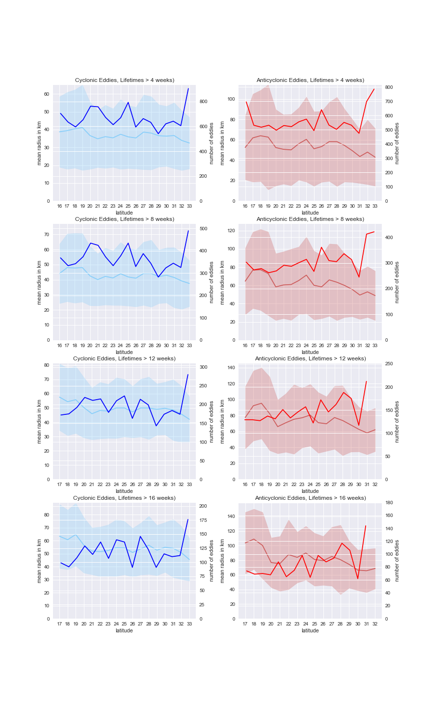

# cv-public-vis

Written by Chad Valencia, chadvalencia@gmail.com

This repo is a sampling of the code for visualizations I developed for David Lindo Atichati, PhD, CUNY Staten Island. Note that the code will not run without the datasets, which are protected for privacy reasons. However, the goal is to present the visualizations and methodology for how I developed each notebook.

### A Word on ETL

After watching the significant .nc file conversion to Pandas, I decided to do an intermediary ETL notebook converting the .nc files to Pandas, cleaning the data and transforming the data for grouping purposes and subsequently exporting these files for quicker load time in the future. In the absence of an intermediary data analysis software, such as Tableau, this provides a way to quickly visualize data in the intermediary step.

The ETL files can be found in the notebooks directory as 'Dataset ETL.ipynb' and 'Dataset ETL-Intervals.ipynb'.

### Visualizations

The dataset given tracked the path and characteristics of eddies of an area in the Pacific Ocean from May 2009 to May 2014. The cleaning process for all visualizations included the following:
  - Removing all data points within a one-degree border from each edge of the dataset.
  - Converting all negative-longitude data to positive longitude data (to ease in calculations, as data went through the anti-meridian line)
  - Binning data where appropriate to prevent counting an eddy that occupied a physical latitude-longitude bin for longer than a month more than once.

This first visualization maps the pathways of the eddies, with cyclonic eddies in blue and anticyclonic eddies in red. It was created with the Basemap package on top of matplotlib, and data was transformed via Pandas.

The next two visualizations are contour maps of the eddies in cyclonic and anticyclonic form that were generated by interpolating data collected in half degree bins using SciPy.

These final two visualizations are graphs comparing different statistics of these eddies.

